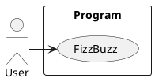
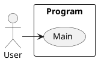
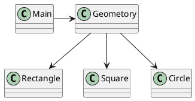
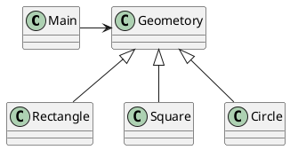
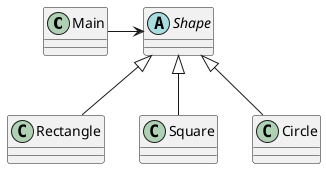
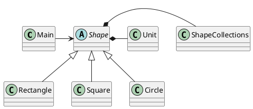
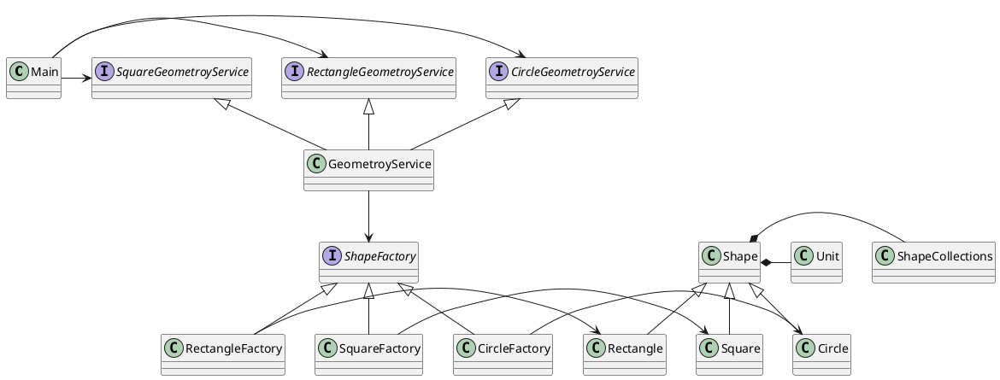
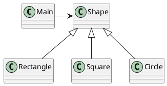

---
markdown:
  image_dir: /draft/images
  path: draft.md
  ignore_from_front_matter: true
  absolute_image_path: false
---
# 良いコードのための原則・パターン・プラクティス練習ガイドドラフト
[TOC]

## 動機
+ なぜ書くのか？
  + 目的
    + どうやったらプログラミングが上達するのか？  
  + 職業プログラマ
  + 原点回帰
  + 古典に学ぶ  
+ 原理・原則
+ 上達方法
  + 練習
    + 地味でつまらないもの
    + 継続・継続・継続
    + 考えるな感じろ
+ プログラミングに必要な技術
  + コード
  + ドキュメント
  + インフラ

## 構成
+ 良いコード
+ 原則
+ パターン
+ プラクティス
+ 良いコードのための練習プログラム集
## 良いコード
### プログラミング
プログラミングとは問題解決行動

#### プログラミングパラダイム
##### SP(Structured Programming)

>The first paradigm to be adopted(but not the first to be invented) was structured programming, which was discovered by Edsger Wybe Dijkstra in 1968. Dijkstra showed that the use of unrestrained jumps(goto statements) is harmful to program structure. As we'll see in the chapters that follow, he replaced those jumps with the more familiar if/then/eles and do/while/until constructs.

>We can summarize the structured programming paradigm as follows:

>Structured programming imposes discipline on direct transfer of control.
[^CA]

##### OOP(Object-Oriented Programming)
>The second paradigm to be adopted was actually discovered two years earlier, in 1966, by Ole Johan Dahl and Kristen Nygaard. These two programmers noticed that the function call stack frame in the ALGOL language could be moved to a heap, thereby allowing local variables declared by a function to exist long after the function returned. The function become a constructor for a class, the local variables become instance variables, and the nested functions become methods. This led inevitably to the discovery of polymorphism through the disciplined use of function pointers.

>We can summarize the object-oriented programming paradigm as follows:

>Object-oriented programming imposes discipline on indirect transfer of control.
[^CA]

##### FP(Fcuntional Programming)
>The third paradigm, which has only recently begun to be adopted, was the first to be invented. Indeed, its invention predates computer programming itself. Functional programming is the direct result of the work of Alonzo Church, who in 1936 invented λ-calculus while pursuing the same mathematical problem that was motivating Alan Turing at the same time. His λ-calculus is the foundation of the LISP language, invented in 1958 by John McCarthy. A foundational notion of λ-calculus is immutability---that is, the notion that the values of symbols do not change. This effectively means that is, the notion that that the values of symbols do not change. This effectively means that a functional language has no assignment statement. Most functional languages do, in fact, have some means to alter the value of a variable, but only under very strict discipline.

>We can summarize the functional programming paradigm as follows:

>Functional programming imposes discipline upon assignment.
[^CA]

#### プログラミングアプローチ
##### POA(ProcessOrientedApproach)
「業務処理プロセス」に着目するアプローチ手法。
POAは、業務内容を中心に設計されるためシステム設計が業務内容に強く依存する。そのため、業務内容が変更になったときにはシステムの大幅な変更が必要となりコスト面の負担が大きくなる。また、各部署の業務内容に応じて独立したシステムになることが多く、他のシステムとのデータ連携が複雑になるという問題がある。

##### DOA(DataOrientedApproach)
「どんなデータを必要とするか」に着目するアプローチ手法。
DOAでは、データを業務プロセスとは切り離して先にERモデルを用いて分析・設計する。業務のモデル化を行う際にデータが最も安定した情報資源であり、かつ共通資源であることを利用するため、業務変更によるシステムへの影響度が少なくなる。また、事象応答分析も行い、外部からの事象とその応答のタイミング的、時間的な関係を抽出し、制御の流れも図式化して分析する。

##### OOA(ObjectOrientedApproach)
「データとそれを操作する手続き（メソッド）の両方、すなわちオブジェクト」に着目するアプローチ手法。
DOAの概念をさらに進めたアプローチ。オブジェクトとは、データ（属性）とそのデータに対する手続き（メソッド）を１つにまとめたものを指す。

##### SOA(ServiceOrientedApproach)
個々のシステムをサービスという概念で捉えてシステムを構築する「やり方」（共通のメッセージ交換インタフェースに対応）。
サービスとは、業務上の１つの処理に相当するソフトウェアの機能。SOAを実現するために必要となる技術基盤は、ほとんどの場合Webサービスとなる。

## 原則
### 基本定理[^UNIXP]
1. スモール・イズ・ビューティフル
1. 一つのプログラムには一つのことをうまくやらせる
1. できるだけ早く試作する
1. 効率より移植性
1. 数値データはASCIIフラットファイルに保存する
1. ソフトウェアの梃子を有効に活用する
1. シェルスクリプトを使うことで梃子の効果と移植性を高める
1. 過度の対話的インタフェースを避ける
1. すべてのプログラムをフィルタにする

### 設計原則[^PPP02]
+ 単一責任の原則(SRP)
+ オープン・クローズドの原則(OCP)
+ リスコフの置換原則(LSP)
+ 依存関係逆転の原則(DIP)
+ インタフェース分離の原則(ISP)

### プログラミング原則
+ KISS (Keep It Simple, Stupid. or Keep It Short and Simple)
+ DRY (Don't Repeat Yourself.)
+ YAGNI (You Aren't Going to Need It.)
+ PIE (Program Intently and Expressively.)
+ SLAP(Single Level of Abstraction Principle.)
+ 名前重要 (Naming is important.)
+ [MonolithFirst](https://martinfowler.com/bliki/MonolithFirst.html)
+ Immutable object
+ Separating concerns

## パターン
### デザインパターン[^GOF]
#### 生成に関するパターン
+ Abstract Factory	関連する一連のインスタンスを状況に応じて、適切に生成する方法を提供する。
+ Builder	複合化されたインスタンスの生成過程を隠蔽する。
+ Factory Method	実際に生成されるインスタンスに依存しない、インスタンスの生成方法を提供する。
+ Prototype	同様のインスタンスを生成するために、原型のインスタンスを複製する。
+ Singleton あるクラスについて、インスタンスが単一であることを保証する。

#### 構造に関するパターン
+ Adapter	元々関連性のない2つのクラスを接続するクラスを作る。
+ Bridge	クラスなどの実装と、呼出し側の間の橋渡しをするクラスを用意し、実装を隠蔽する。
+ Composite	再帰的な構造を表現する。
+ Decorator	あるインスタンスに対し、動的に付加機能を追加する。Filterとも呼ばれる。
+ Facade	複数のサブシステムの窓口となる共通のインタフェースを提供する。
+ Flyweight	多数のインスタンスを共有し、インスタンスの構築のための負荷を減らす。
+ Proxy	共通のインタフェースを持つインスタンスを内包し、利用者からのアクセスを代理する。Wrapperとも呼ばれる

#### 振る舞いに関するパターン
+ Chain of Responsibility	イベントの送受信を行う複数のオブジェクトを鎖状につなぎ、それらの間をイベントが渡されてゆくようにする。
+ Command	複数の異なる操作について、それぞれに対応するオブジェクトを用意し、オブジェクトを切り替えることで、操作の切替えを実現する。
+ Interpreter	構文解析のために、文法規則を反映するクラス構造を作る。
+ Iterator	複数の要素を内包するオブジェクトのすべての要素に対して、順番にアクセスする方法を提供する。反復子。
+ Mediator	オブジェクト間の相互作用を仲介するオブジェクトを定義し、オブジェクト間の結合度を低くする。
+ Memento	データ構造に対する一連の操作のそれぞれを記録しておき、以前の状態の復帰または操作の再現が行えるようにする。
+ Observer (出版-購読型モデル)	インスタンスの変化を他のインスタンスから監視できるようにする。Listenerとも呼ばれる。
+ State	オブジェクトの状態を変化させることで、処理内容を変えられるようにする。
+ Strategy	データ構造に対して適用する一連のアルゴリズムをカプセル化し、アルゴリズムの切替えを容易にする。
+ Template Method	あるアルゴリズムの途中経過で必要な処理を抽象メソッドに委ね、その実装を変えることで処理が変えられるようにする。
+ Visitor	データ構造を保持するクラスと、それに対して処理を行うクラスを分離する。

### エンタープライズアプリケーションアーキテクチャパターン[^PoEAA]
#### ベースパターン
+ ゲートウェイ
+ マッパー
+ レイヤースーパータイプ
+ セパレートインタフェース
+ レジストリ
+ バリューオブジェクト
+ マネー
+ スペシャルケース
+ プラグイン
+ サービススタブ
+ レコードセット

## プラクティス
### XP
#### チームメンバーとしての顧客
#### ユーザーストーリー
#### 短期間のリリースサイクル
  + イテレーションプラン
  + リリースプライン
#### 受け入れテスト
#### ペアプログラミング
#### テストファースト開発
##### TDD
###### F.I.R.S.T
1. Fast(高速)
1. Independent(独立)
1. Repeatable(再現性)
1. Self-Validating(自己検証可能)
1. Timely(適時性)

#### 共同所有権
+ Git

#### 継続的なインテグレーション（統合）
##### Build
+ 仮想マシン
+ コンテナ
+ バージョン管理マネージャ
+ パッケージ管理マネージャ
##### Ship
+ Jenkins
##### Run
+ GitFlow
+ GitHubFlow

#### 持続可能なペース
#### オープンワークスペース
#### 計画ゲーム
#### シンプルな設計
##### 設計の悪臭
1. 硬さ
1. もろさ
1. 移植性のなさ
1. 扱いにくさ
1. 不必要な複雑さ
1. 不必要な繰り返し
1. 不透明さ

#### リファクタリング[^Refactoring]
+ コードの不吉な臭い
+ メソッドの構成
+ オブジェクト間での特性の移動
+ データの再編成
+ 条件記述の単純化
+ メソッド呼び出しの単純化
+ 継承の取り扱い
##### リファクタリングの定義
##### リファクタリングを行う理由
+ リファクタリングはソフトウェア設計を改善する
+ リファクタリングはソフトウェアを理解しやすくする
+ リファクタリングはバグを見つけ出す
+ リファクタリングでより速くプログラミングできる
##### いつリファクタリングをすべきか
+ ３度目の法則
+ 機能追加時にリファクタリングを行う
+ バグフィックスの時にリファクタリングを行う
+ コードレビューの時にリファクタリングを行う

##### リファクタリンかカタログ

#### においと経験則[^CC]
+ コメント
  + C1:不適切な情報
  + C2:退化コメント
  + C3:冗長なコメント
  + C4:記述不足のコメント
  + C5:コメントアウトされたコード  
+ 環境
  + E1:ビルドに複数のステップを要する
  + E2:テストに複数のステップを要する  
+ 関数
  + F1:多すぎる引数
  + F2:出力引数
  + F3:フラグ引数
  + F4:死んだ関数    
+ 一般
  + G1:１つのソースファイルに複数の言語を使用する
  + G2:あって当然の振る舞いが実装されていない
  + G3:境界値に対する不正確な振る舞い
  + G4:安全軽視
  + G5:重複
  + G6:抽象レベルが正しくないコード
  + G7:継承クラスに依存したベースクラス
  + G8:情報過多
  + G9:デッドコード
  + G10:垂直分離
  + G11:不整合
  + G12:雑然
  + G13:人為的な結合
  + G14:機能の羨望
  + G15:セレクタ引数
  + G16:不明瞭な意図
  + G17:責務を持たせる場所の間違い
  + G18:不適切なstatic
  + G19:説明的変数
  + G20:関数名は体を表すべき
  + G21:アルゴリズムを理解する
  + G22:論理的な依存性を物理的なものとする
  + G23:if/elseやswitch/caseよりも多態を好む
  + G24:標準や規約に従う
  + G25:マジックナンバーを名前付けした定数に置き換える
  + G26:正確であれ
  + G27:規約より構造
  + G28:条件をカプセル化せよ
  + G29:条件の非定刑を避ける
  + G30:関数では１つのことを行うべき
  + G31:隠れた時間軸上の結合
  + G32:いいかげんにならないこと
  + G33:境界条件はカプセル化する
  + G34:関数は１つの抽象レベルを担うべき
  + G35:設定可能なデータは高いレベルに置く
  + G36:推移的なナビゲーションを避ける  
+ Java
  + J1:ワイルドカードを使って、長いimportのリストを避ける
  + J2:定数を継承しない
  + J3:定数とenum
+ 名前
  + N1:記述的な名前を選ぶ
  + N2:抽象レベルに適切な名前を選ぶ
  + N3:可能な限り標準の用語を使用する
  + N4:はっきりした名前
  + N5:広いスコープには長い名前を
  + N6:エンコーディングを避ける
  + N7:名前で副作用を示すべき
+ テスト
  + T1:不十分なテスト
  + T2:カバレッジツールを脂油する!
  + T3:ささいなテストを省略しない
  + T4:無視すること指定されたテストは、あいまいさへの問いかけである
  + T5:境界条件テスト
  + T6:バグの周辺は徹底的にテストを
  + T7:失敗パターンは何かを語る
  + T8:テストカバレッジのパターンは何かを語る
  + T9:テストは高速に実行できるべき

#### メタファー
##### 練習[^CCD]
武術もプログラミングも、スピードは練習の成果である。その練習はどちらもに似ている。問題と解決策からなる題目を選び、完全に習得するまで何度も実行するのだ。

###### 練習の背景

最初の練習用プログラム

```c
main()
{
  printf("hello, world\n")
}
```

###### コーディング道場
###### 型
プログラミングの型というのは、プログラミングの問題を解くためにキーボードやマウスの動きの練習である。実際に問題を解くわけではない。解き方はすでにわかっている。問題を解きながら体の動きや意思決定の練習をするのである。
ここでも完全に限りなく近づくことが目標となる。脳や指に動きや反応を覚えさせるために、何度も練習するのだ。練習するうちに、自分の動きや解決策が少しづつ改善・効率化されることに気づくだろう。
型を使った練習は、ホットキーや操作のイデオムの学習に適している。TDDやCI（継続的インテグレーション）などの規律の学習にも優れた方法である。そして、最も重要なのは、よくある問題と解決策の組み合わせを潜在意識に植えつけることで、現実のプログラミングの問題解決方法がわかるようになるということだ。
武術家のようにプログラマは複数の型を知り、定期的に練習することで、記憶に残るようになる。型の多くは、http://katas.softwarecraftsmanship.org にある。

  + [ボウリングゲーム](http://butunclebob.com/ArticleS.UncleBob.TheBowlingGameKata)
  + [素因数分解](http://butunclebob.com/ArticleS.UncleBob.ThePrimeFactorsKata)
  + [ワードラップ](http://thecleancoder.blogspot.jp/2010/10/craftsman-62-dark-path.html)

###### 技
プログラマもこれと同じ練習ができる。[ピンポンゲーム](http://c2.com/cgi/wiki?PairProgrammingPingPongPattern)を使うのだ。まず、２人で型または簡単な問題を選ぶ。次に、１人がユニットテストを書き、もう１人がテストを成功させる。そして、役割を交代する。

###### 乱取り  
２人組でパートナーが問題を解く「技」とよく似ているが、こちらは参加人数が多く、ルールも少し変更されている。まず、プロジェクタに画面を写す。次に、１人がテストを書く。そして、次の人がテストを成功させて、次のテストを書く。これを順番にやっていくのだ。
ここから学べることはすごく多い。他の人が問題を解く様子がよくわかるからだ。それによって、自分のやり方を改善し、スキルを向上させられる。

##### エチュード[^WEB01]
###### ピアノ
###### エチュードは技術習得の近道
エチュードとは、練習曲のこと。
エチュードは必ず何らかの技術習得を目的として作曲されている。繰り返し練習することで、その技術を効率的に身につけられるようになっている。
自分の引きたい曲があって、その曲だけを一生懸命にピアノで練習するより、その曲を弾きこなすのに必要な技術をエチュードで身につけてから練習したほうが短期間で弾くことができるよになる。

###### 初級のエチュード
「バイエル」、「ハノン」、「みんなのオルガン・ピアノの本」、「ブルグミュラー」、「ピアノエチュード集」などのエチュードはピアノを弾くための基本的な技術を習得することができる。

楽譜に書かれている情報を正しく認識できるようになることが初級の段階で学ぶべきこと

###### 中級のエチュードとは
「ソナチネ」、「チェルニー」、「ピアニストの毎日の基礎練習帳」などがある。

中級では表面上に書かれている音符から、作曲者の意図を読み取る力を養う段階に入る。
言いかえれば、ピアノを通して音楽的な表現をどのようにしていくのかということを考え始める段階ということ。

###### プログラマの毎日の基礎練習プログラム
+ 初級のエチュード
  + 指の動かし方
    + エディタ
  + ドキュメントの書き方
    + Markdown
  + 環境の構築方法
    + 仮想マシン
    + バージョン管理
    + パッケージ管理
  + アプリケーション開発ライフサイクル
    + GitHubFlow
    + GitFlow
  + プログラミング３大要素  
    + 原則
    + パターン
    + プラクティス
+ 中級のエチュード
   + 原則
   + パターン
   + プラクティス

###### チェス
###### エンドゲーム・スタディ[^WEB03]
> エンドゲームスタディあるいは単にスタディとは、一種の問題として提示される作り物の（つまり実戦から取られたのではなく創作された）チェスの局面で、一方（通常白）が他方のいかなる指し手に対しても勝つ（または引き分ける）手順を解答として求めるものを言う。なお、エンドゲームスタディはエチュードと呼ばれることもある。

###### 写経[^WEB02]
> 写経は、印刷技術が発展していなかった時代には仏法を広めるため、またはひとつの寺院でも複数の僧侶で修行・講義・研究するために必要なことであった。その後 、写経することに功徳があることが説かれるようになった

 1. ローカルで使える SCM を用意 
 1. 「ほんたった」などで対象の本を固定 
 1. ひたすらサンプルコードを写して実行 
 1. 実行するたびにコミット(コミットログにページ番号を含める) 
 1. 疑問点があったらコミットログや本に書き込む 
 1. 章ごとにタグを打つ


## 良いコードのための練習プログラム集

|     |POA  |DOA  |OOA  |
|:---:|:---:|:---:|:---:|
|SP   | 1   | 2   | -   |
|OOP  | -   | 3   | 4   |
|FP   | -   | -   | 5   |

|     |SP   |OOP  |FP   |
|:---:|:---:|:---:|:---:|
|SRP  | 1   | 2   | -   |
|OCP  | -   | 3   | -   |
|RSP  | -   | 4   | -   |
|ISP  | -   | 4   | -   |
|DSP  | -   | 4   | -   |

|                |SRP  |OCP  |RSP  |ISP  |DSP  |
|:---:           |:---:|:---:|:---:|:---:|:---:|
|Template Method | 3   | 3   | 3   | -   | -   |
|Strategy        | -   | 4   | 4   | -   | -   |
|Facade          | -   | -   | -   | 4   | -   |
|Factory Method  | -   | -   | -   | -   | 4   |
|Abstract Factory| -   | -   | -   | -   | 4   |

### Lesson0:準備運動
#### 目的
+ 原則
+ パターン
+ プラクティス
  + TDD
  + リファクタリング
  + CI
#### 基本仕様
+ ３で割り切れる場合は「Fizz」を出力する。
+ ５で割り切れる場合は「Buzz」を出力する。
+ 両者で割り切れる場合は「FizzBuzz」を出力する。

#### ユースケース

#### コアモデル


### Lesson1:POAによるSPの実装
#### 目的
+ 原則
+ パターン
+ プラクティス
  + コードの整理の基本は名前と段落
#### 基本仕様
#### ユースケース

#### コアモデル

### Lesson2:DOAによるSPの実装
#### 目的
+ 原則
  + 単一責任の原則（SRP）
+ パターン
+ プラクティス
  + 短いメソッド、小さなクラスを使ったコード整理

#### 基本仕様
#### ユースケース

#### コアモデル

### Lesson3:DOAによるOOPの実装
#### 目的
+ 原則
  + オープン・クローズドの原則(OCP)
+ パターン
  + Template Method
+ プラクティス

#### 基本仕様
#### ユースケース

#### コアモデル


### Lesson4-1:OOAによるOOPの実装
#### 目的
+ 原則
  + リスコフの置換原則(LSP)
+ パターン
  + Strategy
+ プラクティス
  + 多態を使うと区分ごとのロジックをif文/swith文を使わずに記述できる

#### 基本仕様
#### ユースケース

#### コアモデル


### Lesson4-2:OOAによるOOPの実装
#### 目的
+ 原則
  + 単一責任の原則(SRP)
  + オープン・クローズドの原則(OCP)
+ パターン
  + バリューオブジェクト
+ プラクティス
  + コレクションオブジェクトで、複雑なロジックを集約して整理する

#### 基本仕様
#### ユースケース

#### コアモデル


### Lesson4-3:OOAによるOOPの実装
#### 目的
+ 原則
  + 依存関係逆転の原則(DIP)
  + インタフェース分離の原則(ISP)
+ パターン
  + Facade
  + Factory  
  + レイヤースーパータイプ
  + セパレートインタフェース
  + スペシャルケース  
  + サービスタブ
+ プラクティス

#### 基本仕様
#### ユースケース

#### コアモデル



### Lesson5:OOAによるFPの実装
#### 目的
+ 原則
+ パターン
  + Iterator
+ プラクティス
  + ブロック
  + 繰り返しの処理:each
  + 特定の条件を満たす要素だけを配列に入れて返す:select
  + 特定の条件を満たさない要素だけを配列に入れt返す:reject
  + 新しい要素の配列を返す:collect
  + 配列の中から、条件に一致する要素を取得する:find
  + 指定した評価式で並び替えた配列を返す:sort
  + 配列の中から、条件に一致する要素を取得する:grep
  + ブロック内の条件式が真である間までの要素を返す:take_while
  + ブロック内の条件式が真である以降の要素を返す;drop_while
  + reduce関数でプログラムを変更する
  + 関数を受ける関数の作成
  + クロージャー
  + ファーストクラスオブジェクト
  + 関数合成
#### 基本仕様
#### ユースケース

#### コアモデル

[^UNIXP]: UNIXという考え方 2001
[^PPP02]: Agile Software Development: Principles, Patters, and Practices, 2002
[^CC]: Clean Code 2090
[^CA]: Clean Architecture 2018
[^CCD]: Clean Coder
[^PoEAA]: Patterns of Enterprise Application Architecture
[^GOF]: Elements of Reusable Object Oriented Software 1996
[^Refactoring]: リファクタリングープログラムの体質改善テクニック 1999
[^WEB01]: [エチュードを練習する重要性│ピアノの上達法](http://piano-practice.click/practice/etude-2/)
[^WEB02]: https://twitter.com/t_wada/status/9000231741
[^WEB03]:https://ja.wikipedia.org/wiki/%E3%82%A8%E3%83%B3%E3%83%89%E3%82%B2%E3%83%BC%E3%83%A0%E3%83%BB%E3%82%B9%E3%82%BF%E3%83%87%E3%82%A3
[^Habits of programming in scratch]: https://dl.acm.org/citation.cfm?doid=1999747.1999796